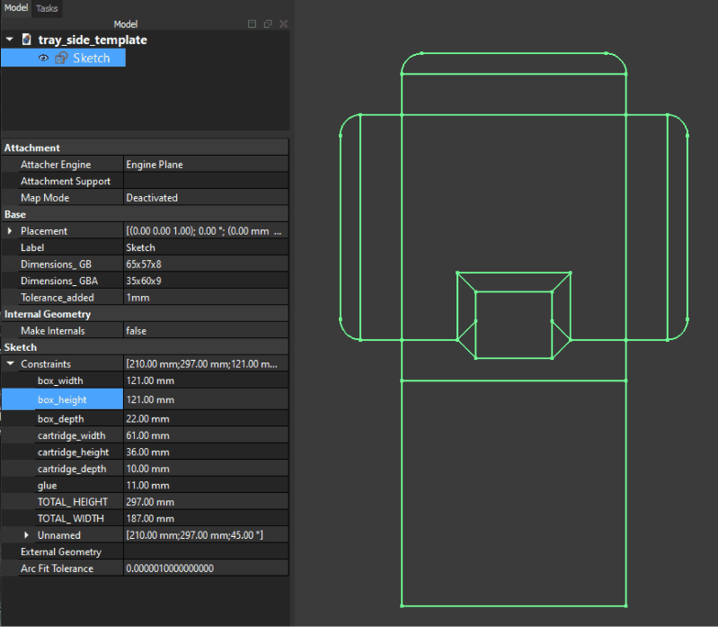
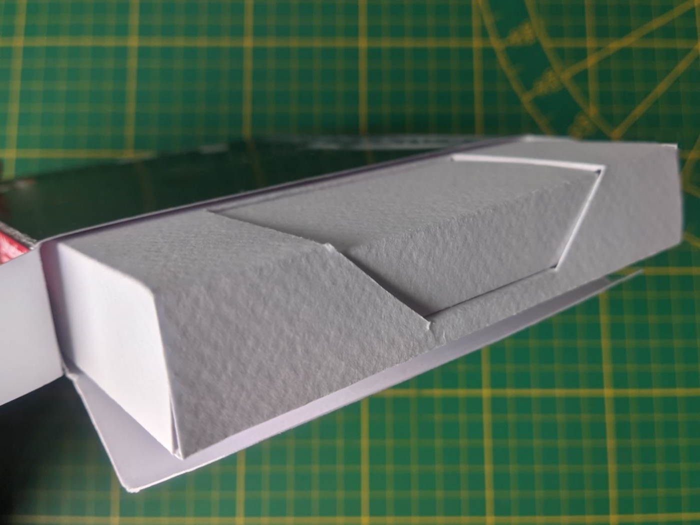
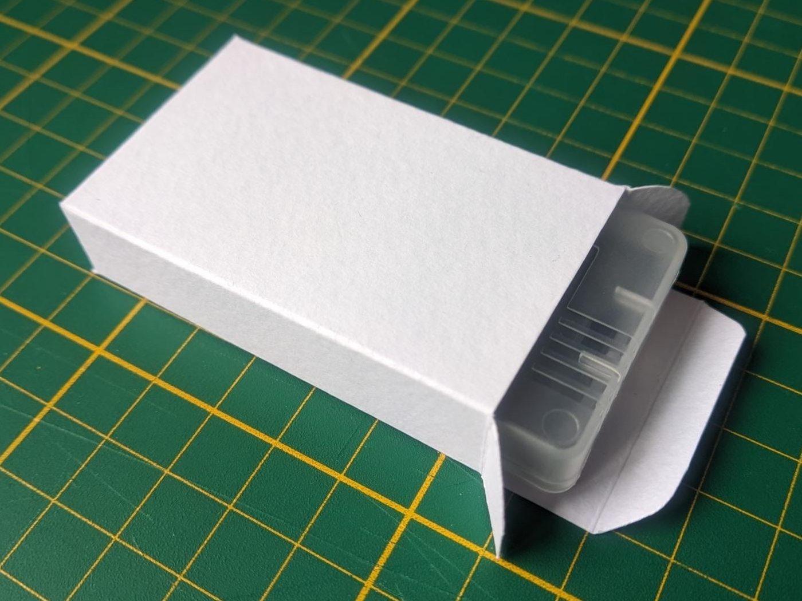

# Game Boy (Color/Advance) Templates

Here you can find templates for Game Boy boxes, inlay insert trays and labels.

---

## Already exported templates

### Inlay Insert Tray

|   | GB/GBC | GBA |
|--:|:------:|:---:|
| SVG |  |  |
| PDF | [GB/GBC PDF Version](./Exported/inlay%20insert%20tray/side/tray_side_gb_gbc.pdf) | [GBA PDF Version](./Exported/inlay%20insert%20tray/side/tray_side_gba.pdf) |

### Box

|   | EUR |
|--:|:---:|
| SVG |  |
| PDF | [EUR PDF Version](./Exported/box/box_eur.pdf) |

The pattern isn't official. It's only a template I made based on the real dimensions. The angle of the flaps or their shapes aren't the same as original boxes. It produces a 125×125×25 mm box, which is sufficient for me. I'm aware some boxes have self-locking Y-shaped bottom flaps, but here I go for a simple model, glued like the side. Maybe I'll design one, maybe not.

### Label

|   | GBA |
|--:|:---:|
| SVG |  |
| PDF | [Label GBA](./Exported/label/label_gba.pdf) |

### Mini Box for GBA Cartridge Plastic Case

|   | GBA Mini Box | Insert Tray for GBA Mini Box |
|--:|:--------:|:------------------------:|
| SVG |  |  |
| PDF | [Mini Box for Cartridge Plastic Case](./Exported/mini%20box/mini_box_plastic_case_gba.pdf) | [Insert Tray for Mini Box](./Exported/mini%20box/insert_tray_mini_box_gba.pdf) |

For the tray I took the dimensions of the GBA Mini Box (40×65×15 mm) and added 2 mm clearance.

## What are these files?

They are CAD files I made with [FreeCAD](https://www.freecad.org/), describing the patterns for game boxes and inlay insert trays. Being CAD files, you can adjust the dimensions dynamically, from regular box or cartridge sizes to custom ones without any trouble. You can then export the drawing to SVG or PDF to print it. For simplicity, I've already created SVG and PDF versions for GB/GBC/GBA standard dimensions.

|  |
|:-:|
| Updating dimensions dynamically |

## What are the dimensions of boxes and cartridges?

All dimensions are height × width × depth.

For the boxes, I measured one and found 125×125×25 mm.

For the cartridges, I used [ConsoleMods.org](https://consolemods.org/wiki/Dimensions_for_Game_Cartridges) and found:
- GB: 65×57×8 mm
- GBA: 35×60×9 mm

For the labels, also on [ConsoleMods.org](https://consolemods.org/wiki/Cart_Labels):
- GBA: 22×43 mm

I removed 1 mm for clearance for the cartridge space in the inlay insert tray, and set the tray dimensions to 121×121×22 mm so it fits well inside a box.

---

## Images

|  |  |  |
|:-:|:-:|:-:|
| Box and Insert Tray for GBA Mini Box | Insert Tray for GBA Mini Box | Mini Box for GBA Plastic Case |